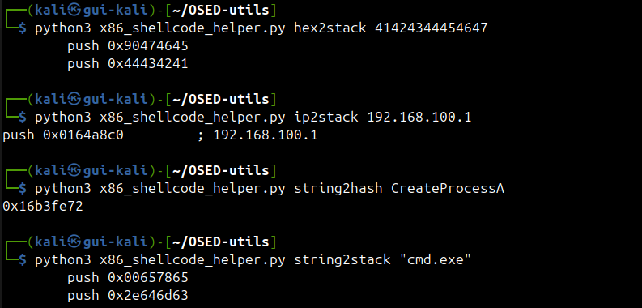
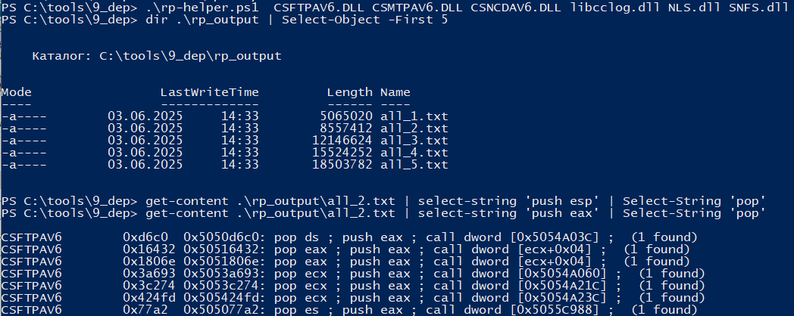
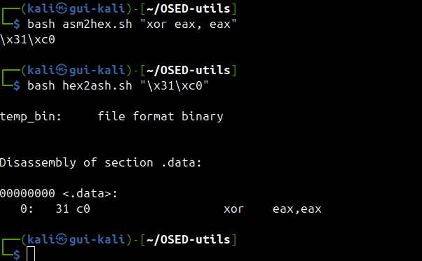

# OSED-utils

This repository contains two main scripts for binary exploitation and reverse engineering tasks:


## x86_shellcode_helper.py

A Python CLI utility for stack manipulation and hashing, useful in exploit development and shellcode crafting.

### Features


### Usage

Run with Python and the desired command:

```bash
python x86_shellcode_helper.py <command> [arguments]
```

See `python3 x86_shellcode_helper.py --help` for details.


*Example: Using x86_shellcode_helper.py*

## rop_rp_helper.ps1

A PowerShell script to automate ROP gadget extraction using rp-win-x86.exe.

### Features


### Usage

Requires Windows and rp-win-x86.exe. Run in PowerShell:

```powershell
powershell -File rop_rp_helper.ps1 <binary1> <binary2> ...
```

Outputs are saved in the `rp_output` directory.


*Example: Using rop_rp_helper.ps1*

---

## asm2hex.sh

A Bash script to assemble x86 instructions (inline or from a file) and extract their opcodes as hex bytes.

### Usage

```bash
./asm2hex.sh "mov eax, 1; int 0x80"
./asm2hex.sh file.asm
```


## hex2asm.sh

A Bash script to convert a hex string (e.g., shellcode) back to x86 assembly instructions using objdump.

### Usage

```bash
./hex2asm.sh "\x31\xc0\xb0\x01\xcd\x80"
```

---

## asm2hex.sh & hex2asm.sh

These Bash scripts help convert between x86 assembly and shellcode hex bytes:
- **asm2hex.sh**: Assemble x86 instructions (inline or from a file) and extract their opcodes as hex bytes.
- **hex2asm.sh**: Convert a hex string (e.g., shellcode) back to x86 assembly instructions using objdump.

### Usage

To convert assembly to hex:
```bash
./asm2hex.sh "mov eax, 1; int 0x80"
./asm2hex.sh file.asm
```

To convert hex to assembly:
```bash
./hex2asm.sh "\x31\xc0\xb0\x01\xcd\x80"
```


*Example: Using asm2hex.sh & hex2asm.sh*

For more details, see comments in each script.
